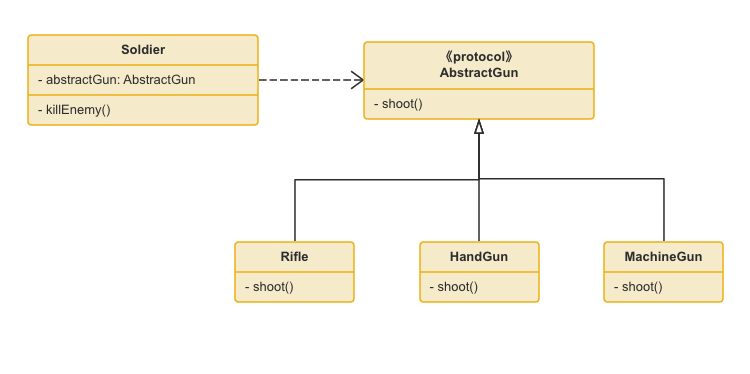

# 里氏替换原则

#### 定义

里氏替换原则英文名称：Liskov Substitution Principle,简称是LSP。
单一责任原则的定义是：只要父类能出现的地方子类就可以出现，而且替换为子类也不会产生任何错误或异常，使用者可能根本就不需要知道是父类还是子类。但是，反过来就不行了，有子类出现的地方，父类未必就能适应

里氏替换原则指明:

如果S是T的子类型,那么对象T可以在任何需要T的地方被对象S替换,而程序的行为不会受到影响。

也就是说,子类型必须可以替换其基类型,使程序仍然行为正确。

里氏替换原则强调继承关系中类型间的 `可替换性`,是面向对象设计的重要原则

#### LSP类使用的结构图

